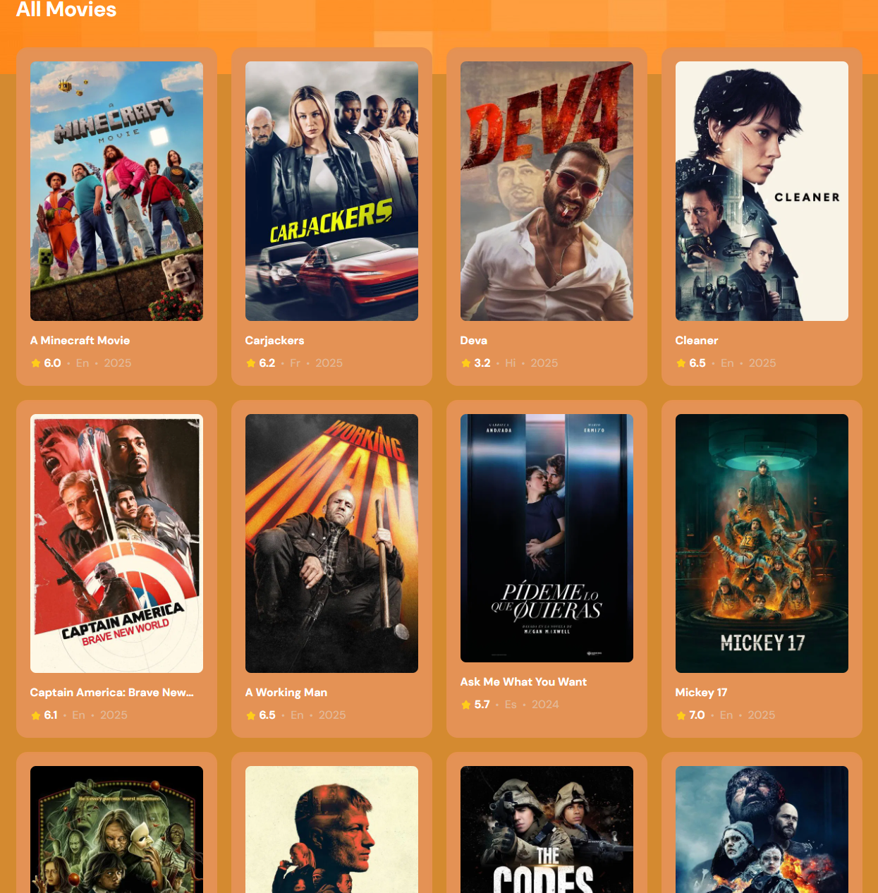
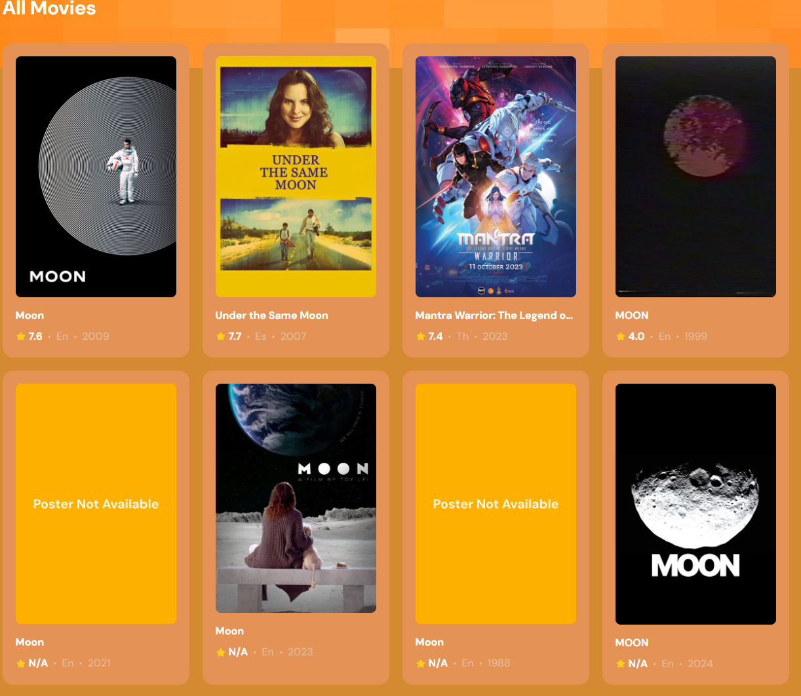
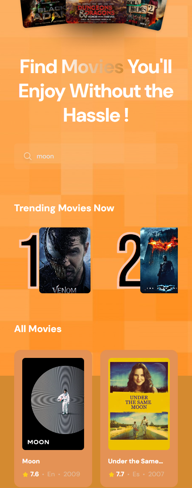
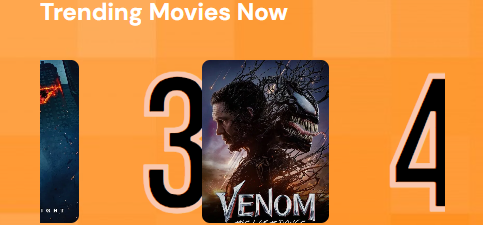

# 🎬 MoviesReact

**MoviesReact** is a simple React app that fetches and displays movies using the [TMDB API]([https://developer.themoviedb.org]. It allows users to search for movies by title and view basic information like poster, title, and release year.

## 🚀 Features

- 🔍 Search features that searches movies by title and stores them in a "netflix" suggestion panel as trending movies now..
- 🎥 Display movie posters and details such as name , rating , language and year was made.
- 🌐 Fetch data from the TMDB API such as popularity of the movie , poster , year , name , language.
- ☁️ Store data using Appwrite (e.g., favorites, saved searches, or logs)
- 💡 Clean, simple, responsive and fast UI built with React Vite


## 🛠️ Tech Stack

- React Vite (with Hooks and States)
- JavaScript (ES6)
- CSS
- Laravel
- TMDB API
- Appwrite (for cloud storage)

## 📦 Installation

1. Clone the repository:
   ```bash
   git clone https://github.com/baftjarjusufi/moviesreact.git
   cd moviesreact
2. Install dependencies:

     - npm install

3. Set up Appwrite:

  - Make sure you have an Appwrite instance (self-hosted or cloud).

  - Create a project and database with the required collections.

  - Add your Appwrite credentials (project ID, endpoint) in the app (usually in a .env file).

4. Start the development server:

     - npm run dev 


🌍 Live Demo

Demo website: https://moviesreact-chi.vercel.app/
Demo website : https://moviesreact.pages.dev/

## 📸 Screenshots in case the demo website doesnt work 












## 📸 Gif !!


